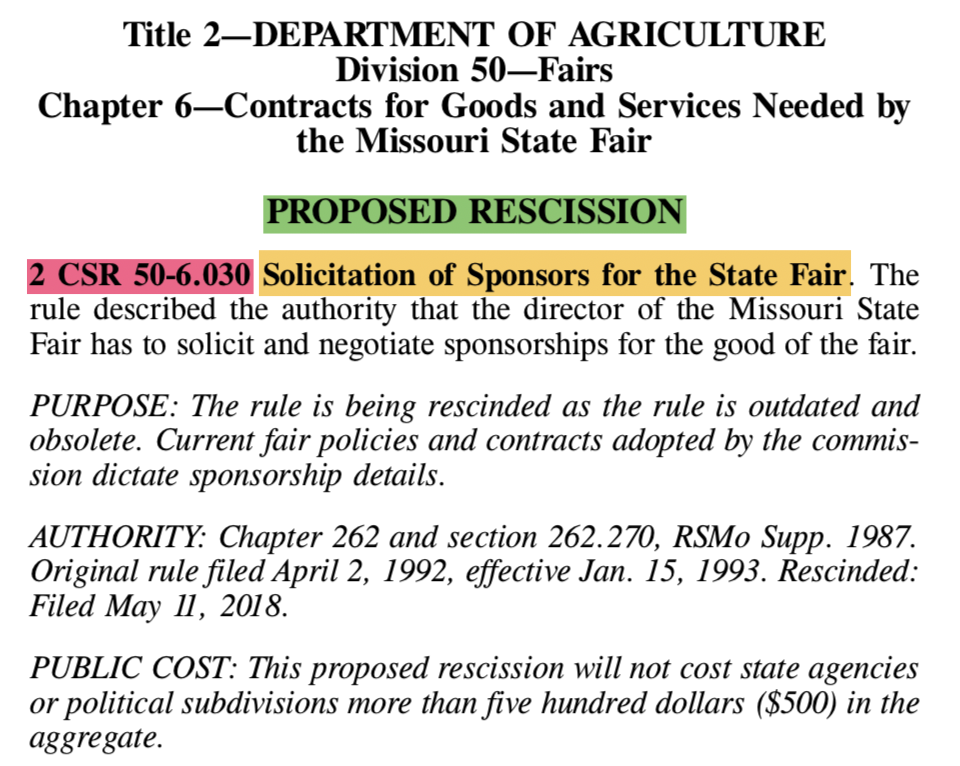
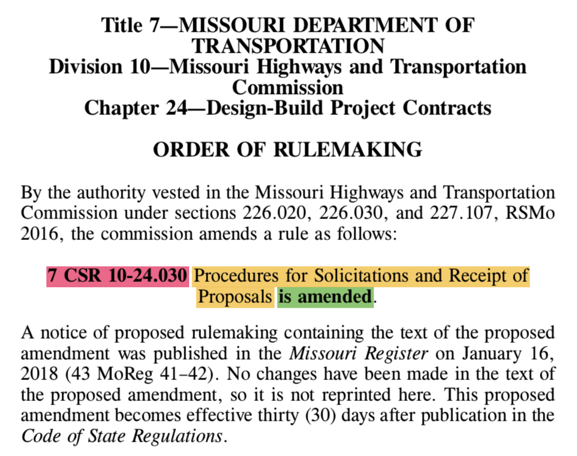

# Live Rule Tracker

## Proposed Rules Parser



```ruby
lines.each_with_index do |line, idx|
  if line.include?("PROPOSED AMENDMENT") || line.include?("PROPOSED RESCISSION")
    begin
      jdx = idx
      key_line = lines[jdx]

      until key_line.include?(". ")
        jdx += 1
        key_line = key_line.gsub("\n", " ") + lines[jdx]

        # throws an error for edge cases, expected incidence <1%
        raise "!-- MANUAL REVIEW REQUIRED: Error Buffer Exceeded --!" if jdx - idx >= error_buffer
      end

      action = line.include?("AMENDMENT") ? "Amend" : "Rescind"
      regexp = key_line.match(/^\D*(?<CODE>\d+\s+CSR\s+[-.\d\s]+)\s*(?<DESCRIPTION>.*?)(?=\. .+$)/)
      raise "!-- MANUAL REVIEW REQUIRED: RegExp Returned nil --!" if regexp.nil?

      rule_citation, rule_description = regexp.captures

      add_to_airtable(Rule.new(rule_citation, rule_description, action, "Proposed (Formal)", file_name))
      # [...]
```

## Final Rules Parser



```ruby
  lines.each_with_index do |line, idx|
    if line.include?("is amended.") || line.include?("is rescinded.")
      begin
        key_line = line
        jdx = idx

        until key_line.include?("CSR")
          jdx -= 1
          key_line = lines[jdx].gsub("\n", " ") + key_line

          # throws an error for edge cases, expected incidence <1%
          raise "!-- MANUAL REVIEW REQUIRED: Error Buffer Exceeded --!" if idx - jdx >= error_buffer
        end

        action = line.include?("amended") ? "Amend" : "Rescind"
        regexp = key_line.match(/^.*(?<CODE>\d+\s+CSR\s+[-.\d\s]+)\s*(?<DESCRIPTION>.*?)(?=\s+is #{action.downcase}ed.+$)/)
        raise "!-- MANUAL REVIEW REQUIRED: RegExp Returned nil --!" if regexp.nil?

        rule_citation, rule_description = regexp.captures

        add_to_airtable(Rule.new(rule_citation, rule_description, action, "Final Order", file_name))
      # [...]
```

## Next Steps & Future Development
